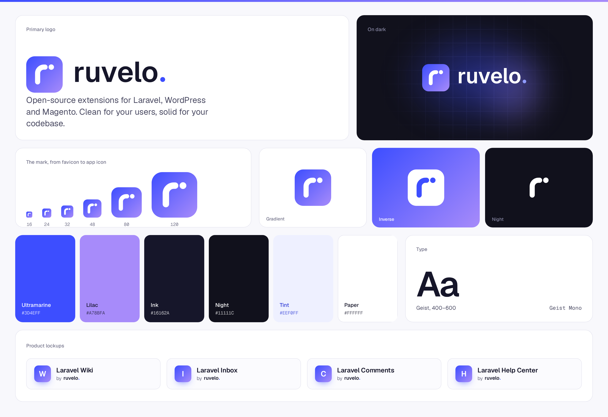

# The Ruvelo house style

Ruvelo makes extensions and apps for Laravel, WordPress, Magento and whatever comes next. Everything we ship should feel like it came from the same studio: **clean, modern and simple to use, built for developers and good-looking enough for everyone else.**

This guide is the reference. The tokens live in [`brand/ruvelo.css`](brand/ruvelo.css); copy them, don't reinvent them.

## Principles

1. **Calm base, one signature.** Interfaces are mostly white space and cool neutrals. Personality comes from one place: ultramarine, its lilac glow, and the details listed below. If everything is accented, nothing is.
2. **Works everywhere, depends on nothing.** No build step for users, no JavaScript required for core features, no external requests from code that runs inside someone else's app. Light and dark mode always.
3. **Developers first, never developer-only.** Typed APIs, clear errors and real docs, wrapped in something a non-developer would happily click around.
4. **Say less, mean it.** Plain words, active voice, no hype.

## Logo

The mark is a rounded *r* and a dot on the ultramarine-to-lilac gradient. The dot is the signature: it reads as a full stop, and as the dot of a notification. The wordmark is *ruvelo.* in Geist SemiBold, lowercase, ending in the same dot in ultramarine (the lighter `#8F9BFF` on dark). The letters are outlines, so the logo looks the same everywhere without loading a font.

| File | Use |
|---|---|
| [`brand/logo.svg`](brand/logo.svg) | Primary logo on light backgrounds |
| [`brand/logo-white.svg`](brand/logo-white.svg) | On dark or photo backgrounds |
| [`brand/mark.svg`](brand/mark.svg) | The mark alone: favicons, avatars, app icons |
| [`brand/mark-inverse.svg`](brand/mark-inverse.svg) | The mark on the brand gradient or ultramarine |
| [`brand/mark-night.svg`](brand/mark-night.svg) | The mark on very dark backgrounds |
| [`brand/wordmark.svg`](brand/wordmark.svg), [`wordmark-white.svg`](brand/wordmark-white.svg) | The name alone, e.g. "by ruvelo." |
| [`brand/avatar.png`](brand/avatar.png) | 512×512 for GitHub, X and Packagist profiles |

- Leave clear space around the logo of at least the height of the dot's circle times three.
- The mark works down to 16px; below 24px, prefer it to the full logo.
- Don't recolour, stretch, outline or add effects to the logo, and don't set "ruvelo" in another typeface.
- Products pair their own initial in the gradient square with their name and "by ruvelo.", as on the board.

## Colour

| Token | Light | Dark | Use |
|---|---|---|---|
| `--rv-ultramarine` | `#3D4EFF` | `#8F9BFF` | The brand. Links, primary buttons, focus, highlights |
| `--rv-lilac` | `#A78BFA` | `#C4B5FD` | Only paired with ultramarine: gradients and glows |
| `--rv-bg` | `#FFFFFF` | `#11111C` | Page |
| `--rv-subtle` | `#F8F8FC` | `#171725` | Panels, code blocks, table headers |
| `--rv-muted` | `#F0F0F7` | `#1F1F30` | Inputs, inline code |
| `--rv-line` | `#E4E4EF` | `#2A2A3F` | Borders and dividers |
| `--rv-text` | `#16162A` | `#F1F1F8` | Body text and headings |
| `--rv-text-2` | `#4B4B63` | `#B6B6CC` | Secondary text |
| `--rv-text-3` | `#74748B` | `#8787A3` | Metadata, captions |
| `--rv-accent-soft` | `#EEF0FF` | `#1E2150` | Tinted panels, chips, hover |
| `--rv-danger` | `#E5384F` | `#FF6B80` | Errors, destructive actions, "missing" states |
| `--rv-success` | `#167A4A` | `#74D6A2` | Confirmations, additions |

Neutrals lean slightly toward indigo, never pure grey, so even quiet screens carry the brand. Ultramarine on white passes WCAG AA for text.

## Type

- **Geist** for everything, **Geist Mono** for code. Both are free (SIL OFL). Websites load them from Google Fonts; packages fall back to the system stack so they never fetch fonts into a host app.
- Headings: weight 600, tracking `-0.02em`. Hero headlines: weight 600, tracking `-0.045em`, sizes up to `4.5rem`.
- Body: 15–16px, line height 1.6 (UI) to 1.75 (long reading). Lines under 80 characters.
- Sentence case everywhere. No all-caps labels.

## The signature details

These make a screen recognisably Ruvelo. Use them, and don't add others.

- **The stripe:** a 3px ultramarine-to-lilac bar across the top of every app (`.rv-stripe`).
- **The mark:** a gradient rounded square holding a rounded *r* and a dot. Products show their own initial in it; Ruvelo shows the *r·*.
- **Primary buttons in ultramarine** with a soft coloured shadow. Secondary buttons are outlined in `--rv-line`.
- **Tinted panels:** helpful asides (a table of contents, related links, tips) sit on `--rv-accent-soft` with an ultramarine label.
- **Chips and avatars:** fully rounded, accent-soft background, accent text. People show as their initials.
- **On websites only:** a faint 44px grid fading from the top of the hero, an ultramarine/lilac glow behind the main visual, and one dark `--rv-night` band for the developer section.

## Shape and space

- Radius 8px for controls, 14px for panels and code, fully round for chips.
- Borders over shadows. The only shadows are the accent glow on primary buttons and hero visuals.
- Spacing on a 4px base (`--rv-space-*`). Reading width 52rem, page width 72rem.
- Mobile first: every layout works at 360px with a 16px gutter.

## Voice

- Name things by what people do: "Recent changes", not "Revision log".
- Buttons say what happens: "Save changes", "Restore this version".
- Errors say what went wrong and how to fix it, without apologising.
- Empty states invite the next action: "The wiki is empty. Write the first page."

## Every Ruvelo package

Naming: `ruvelo/<platform>-<thing>` on Composer (`ruvelo/laravel-wiki`, `ruvelo/wp-…`, `ruvelo/magento2-…`), `Ruvelo\<Product>` as the PHP namespace, `Ruvelo_<Module>` for Magento modules.

**Code**
- PHP 8.3+, `declare(strict_types=1)`, typed everything.
- Laravel Pint (Laravel preset), PHPStan level 8 (Larastan for Laravel). No ignores, no baselines.
- Tests on every supported framework and PHP version in CI, including lowest dependencies.
- One write path per concept, typed exceptions, events for every change, a factory for host-app tests.
- `composer check` runs lint, analysis and tests: exactly what CI runs.

**Repository**
- README: banner, badges, live demo, a screenshot tour, install in three lines, then the details.
- A website on GitHub Pages at `ruvelo.github.io/<repo>` with a live demo built from the package itself.
- `CONTRIBUTING.md`, `CHANGELOG.md` (Keep a Changelog), SemVer tags, Dependabot.
- Community files (code of conduct, security policy, issue and PR templates) come from this `.github` repo automatically.
- Credits: "Built by François Bultez at Ruvelo, and everyone who contributes."
